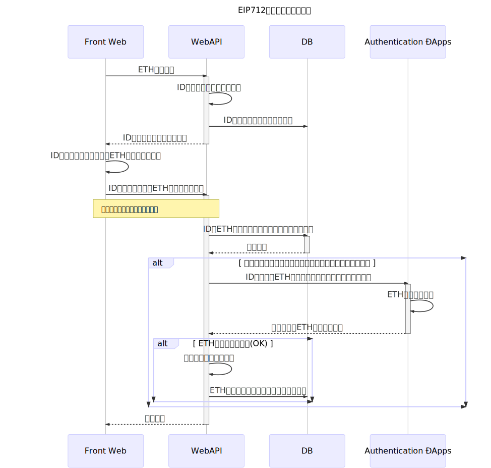

# Signature verification implementation for EIP712

*Read this in other languages: [English](README.em.md), [日本語](README.ja.md).*

*It is under development.*

## Overview

Use an EIP 712 signature scheme and implement it so that the content can be checked at the time of signing.

## Main point

Include the person's EOA address as a signature when signing.

If the EOA address obtained from the signature is the same as the EOA in the signature, it can be confirmed that the person has correctly signed it.

(If there is no EOA address in the signature, it is difficult to determine if the EOA address obtained from the signature is that of the correct requester)

## specification

### Verification of proxy transfer execution of token remittance: TokenExchangeVerification.sol

The token remittance request is signed, and the agent confirms that the EOA address obtained from the signature matches.

Domain part:

```
    struct EIP712Domain {
        string name;
        string version;
        uint256 chainId;
        address verifyingContract;
        bytes32 salt;
    }
```

Value type to sign:

```solidity
    struct Exchange {
        address sender;
        uint256 amount;
        bytes32 key;
    }
```

### Identity Authentication with EIP 712 Signature: Authentication.sol

Sign with the secret key obtained from the server and the Externally Owned Account (EOA) address. Make sure that the EOA address obtained from the signature matches.

Domain part:

```
    struct EIP712Domain {
        string name;
        string version;
        uint256 chainId;
        address verifyingContract;
        bytes32 salt;
    }
```

Value type to sign:

```solidity
    struct Auth {
        uint256 authId;
        address user;
        bytes32 key;
    }
```

- Send an EOA (Externally Owned Account) address that you want to authenticate with the Web API, and issue an ID and secret key
- Sign the 3 values of ID, Secret key and EOA address with EIP 712 (EOA address used in signing and EOA address included in same)
- Send ID, signature, EOA address, secret key to smart contract and get EOA address used for signing
- If the received EOA address and the EOA address obtained from the signature match, it is judged as a request from the EOA address



## Implementation

The implementation will be published on GitHub.

https://github.com/godappslab/signature-verification

You can also operate this smart contract from the website. (Currently available only for Ropsten Test Network)

- EIP712 TokenExchangeVerification https://lab.godapps.io/eip712-token-exchange-verification
- EIP712Authentication https://lab.godapps.io/eip712-authentication

## References

**Standards**

1. EIPs / eip-712.md at master · ethereum / EIPs https://github.com/ethereum/EIPs/blob/master/EIPS/eip-712.md
2. EIP-712: eth_signTypedData as a standard for machine-verifiable and human-readable typed data signing https://ethereum-magicians.org/t/eip-712-eth-signtypeddata-as-a-standard-for-machine-verifiable -and-human-readable-typed-data-signing / 397
